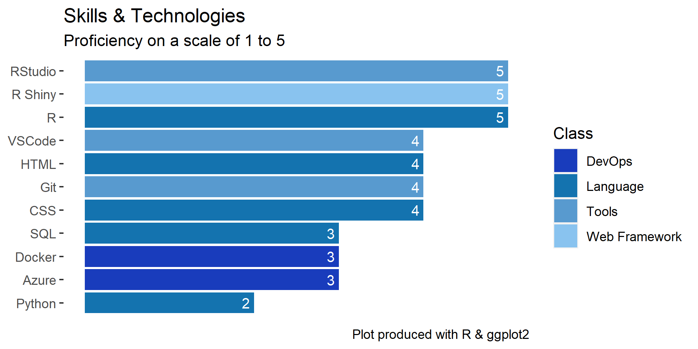

[Email](mailto:dawiegr@gmail.com) / [LinkedIn](https://www.linkedin.com/in/dawie-griesel/) / [GitHub](https://github.com/dawiegriesel/) 

# About
Digital transformation is a new paradigm in the world of business. It is a new way of thinking about business, and it is a new way of doing business. I am a qualified charterred accountant that believe that technology will transform our industry completely. Using R and Shiny, I have created various web applications for local government to enable data analysis, long-term financial planning, and performance measurement the digital way. 
# Professional Experience
## Cloud based data product development
Developed the first of it's kind cloud based data product for the local government. The product is a web application that allows users to view, analyse data using statistical models as well creating lonf-term finanancial plans using business logic, accounting principles and predictive models (ML & AI). The product is built using R and Shiny.
## Effective and Accountable in C-level Roles
Overcome complex business challenges and make high-stakes decisions using experience-backed judgement, strong work ethic and integrity.
## Strategy & Business Development Specialist
Characterized as delivering extraordinary results in growth, revenue, operational performance and profitability. Heavy transaction background including start-up financing, mergers and acquisitions and sale of company.
## Deliver mission-critical results
Driven by the need to be innovative and to build strategies and tactics to make the words “It can’t be done!” obsolete.
## Strong orientations in operations and finance
Participate in high-level operational initiatives, including infrastructure design, process re-engineering, turnaround management and reorganization.
## Respect and leverage human capital
Motivate, mentor and lead talented staff. Live the culture and lead by example. Direct teams using interactive and motivational leadership that spurs people to willingly give 110% effort and loyalty.

# Skills and technologies

# Most Recent Role: Akhile Digital
CTO and Data Scientist. 
* Responsible for the development of MST (Municipal Sustainability Tool) platform
* Management of the development team that develop and support various cloud based applications for the local government digital transformation journey.
* Data analytics and statistical modelling on various projects for local and national government.

# Employment History
## Aug 2019 - Present: Akhile Digital
CTO and Data Scientist
## Apr 2015 - Jul 2019: Wellness Odyssey
CEO of Wellness Odyssey, 2nd largest wellness company in South Africa.
* Digital transformed the business model of Wellness Odyssey from a traditional business to a digital business.

## Dec 2012 - Mar 2015: WAD Holdings
Business Development:  	
* Feasibility studies of new ideas and projects 
* Financial modelling 
* Valuations of potential new acquisitions  
* Desktop reviews of financial information 
* Deal structuring and formulation of term sheets

## Oct 2003 - Nov 2012: Freelance Consultant
* Corporate finance
* Financial modelling
* Due diligence
* SAP implementation

## Jan 1997 - Sep 2003: Ernst & Young (EY)
Senior manager
* Financial Services (Treasury Division)
* Corporate finance
* Audit
